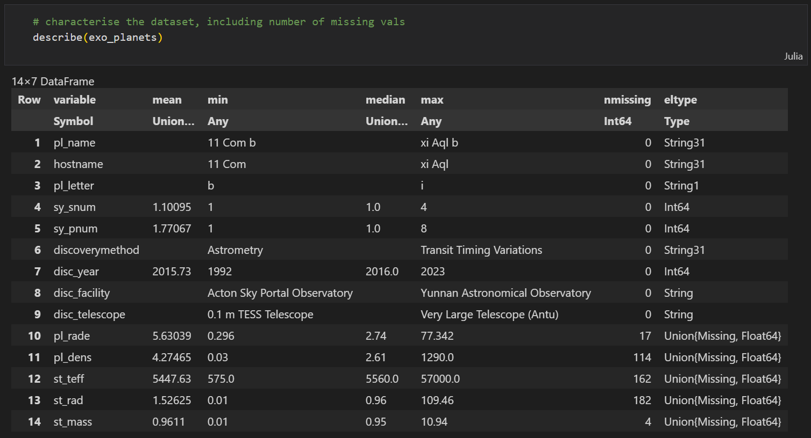
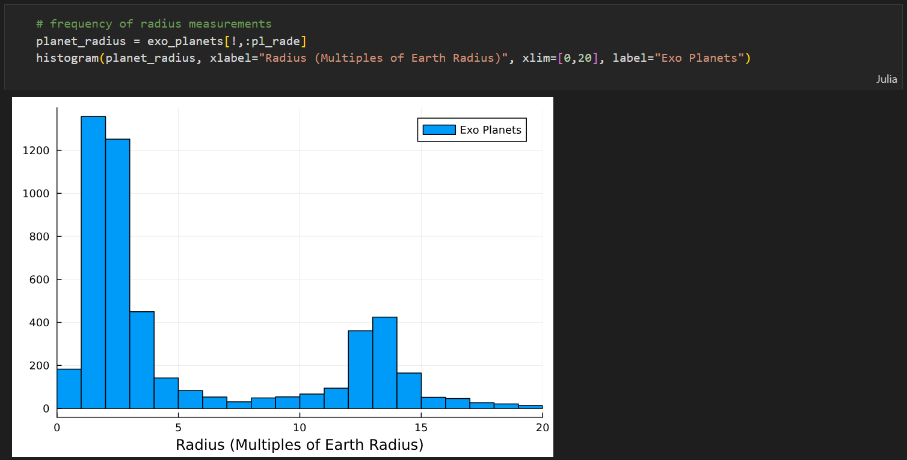

# Exoplanet Exploratory Analysis

Importing a dataset of exoplanets and using the Julia programming language to conduct some exploratory statistical analysis on the contents.

# Features
- Importing a 33MB CSV file
- Generating descriptive statistics
- Removing missing values
- Plotting histograms
- Creating scatter plots

# Data source

https://exoplanetarchive.ipac.caltech.edu/cgi-bin/TblView/nph-tblView?app=ExoTbls&config=PSCompPars

# Screenshots

